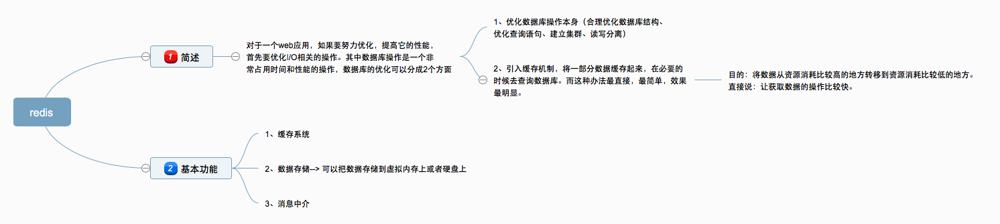

Redis基本介绍

   对于一个web应用，如果要努力优化，提高它的性能， 首先要优化与I/O相关的操作。
其中数据库操作是一个非常占用时间和性能的操作， 数据库的优化可以分成2个方面:

1. 优化数据库操作本身(合理优化数据库结构、优化查询语句、建立集群、读写分离)
2. 引入缓存机制，将一部分数据缓存起来，在必要的时候去查询数据库。这种办法最直接，最简单，起到的效果最明显

缓存的目的是:
把数据从资源消耗比较高的地方转移到资源消耗比较低的地方。直接的说:让获取数据的操作比较快。

基本功能:

1. 缓存系统
2. 数据存储 可以把数据存储到虚拟内存上或者硬盘上
3. 消息中介 消息的订阅和发布

端口:

redis 6379	
mongodb 27017

Redis基本应用

1. 存储和获取值	--> set.js
2. 列表
3. 集合
4. 消息中介

 Redis 在express

# study_redis
