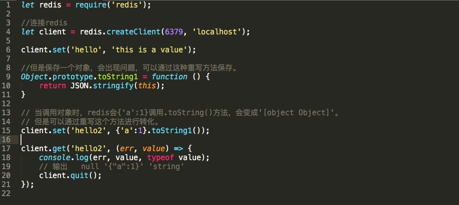
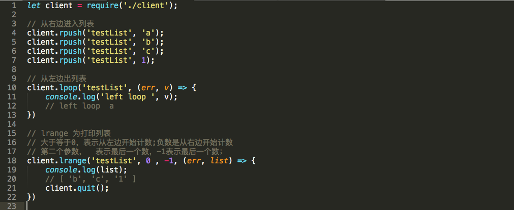
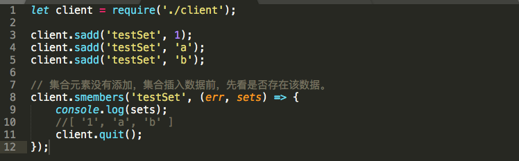
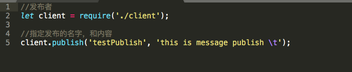

### redis 基本介绍

   对于一个web应用，如果要努力优化，提高它的性能， 首先要优化与I/O相关的操作。
其中数据库操作是一个非常占用时间和性能的操作， 数据库的优化可以分成2个方面:

1. 优化数据库操作本身(合理优化数据库结构、优化查询语句、建立集群、读写分离)
2. 引入缓存机制，将一部分数据缓存起来，在必要的时候去查询数据库。这种办法最直接，最简单，起到的效果最明显

缓存的目的是:
* 把数据从资源消耗比较高的地方转移到资源消耗比较低的地方。
* 直接的说:让获取数据的操作比较快。

### redis 基本功能

1. 缓存系统。
2. 数据存储，可以把数据存储到虚拟内存上或者硬盘上。
3. 消息中介，消息的订阅和发布。

端口信息:
redis 6379，mongodb 27017

操作之前要确保redis服务启动。
```
brew info redis  //获取redis安装信息
brew services start redis   //启动redis服务
redis-cli	//连接reids数据库进行操作
```

进入redis服务器的操作
```
keys *	// 获取所有健值
get key // 获取key这个健值的value值
```

### Redis 基本应用

1. 存储和获取值	--> set
2. 列表			--> list
3. 集合			--> sadd
4. 消息中介      ---> subscribe、publish

1、set 用法



2、list 用法



3、sadd用法（集合用法）

集合和list的区别是集合中没有重复元素，而list可以允许重复



4、消息中介

 * 建立订阅者

 

 * 建立发布者

 


 按照

[redis install](https://medium.com/@petehouston/install-and-config-redis-on-mac-os-x-via-homebrew-eb8df9a4f298)
