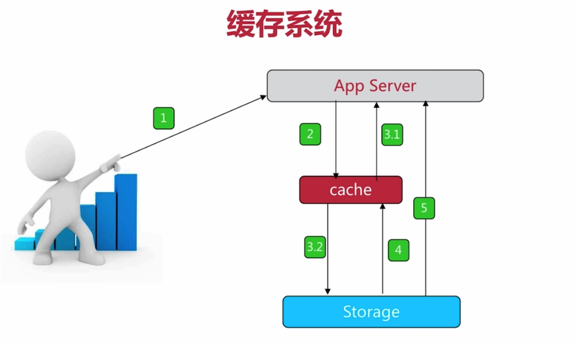

1、redis速度快的最重要的原因是内存，

这张图相信大家十分熟悉，从上到下，速度是越来越慢的

2、redis典型使用场景

	+ 缓存系统
	+ 计数器
	+ 消息队列
	+ 排行榜
	+ 社交网络

缓存系统

1、用户访问app server时
2、先访问cache
3、	
	3.1 cache有，直接返回
	3.2 cache无，访问storage

4、获取storage数据，存到cache中
5、把storage 数据返回用户

3、redis可执行文件说明
	1、redis-server		//Redis服务器
	2、redis-cli			//Redis命令行客户端
	3、redis-benchmark 	//Redis性能测试
	4、redis-check-aos	//AOF文件修复工具
	5、redis-check-dump	//RDB文件检查工具
	6、redis-sentinel	//Sentinel 服务器

4、三种启动方式
	1、redis-server	//使用redis默认配置进行启动
		验证:
		ps -ef | grep redis
		netstat -antpl | grep redis
	2、动态端口启动方式
	    redis-server --port 6380	//以6380端口进行启动redis
	3、配置文件的方式进行启动

注意:

`生产环境建议使用配置文件的方式进行启动`

redis字符串实战，记录网站每个用户个人主页的访问量。

incr userid:pageview

